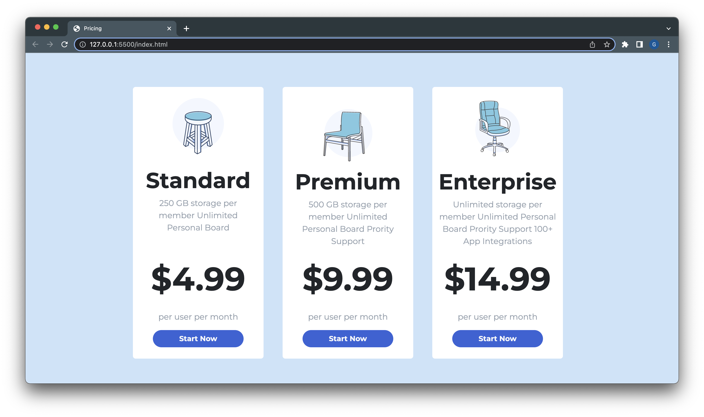

# Pricing Page

HTML/CSS pricing page that can be used for a website. This is from an Adobe XD template.

---

## License


---

## Table of Contents:

- [License](#license)
- [Technologies](#technologies)
- [Description](#description)
- [Installation](#installation)
- [Application](#application)
- [Contact](#contact)

---

## Technologies:

- HTML
- CSS
- Bootstrap

---

## Description

#### Why did you build this project?

- Introduce myself into using Adobe XD to take a UX/UI kit template and replicate it to specifications.

#### What challenges did you face?

- One of the challeneges I faced was adjusting the SVG's to fit into the page accordingly due to the XD file not having the images available.

---

## Installation

1. Clone repo from GitHub

   ```
   gh repo clone geoescobar/pricing-page
   ```

2. Find run options from operating menu options

   ```
   Right click in index.html file and select open in default browser
   ```

---

## Application

#### [Demo](https://effervescent-panda-390198.netlify.app/)


